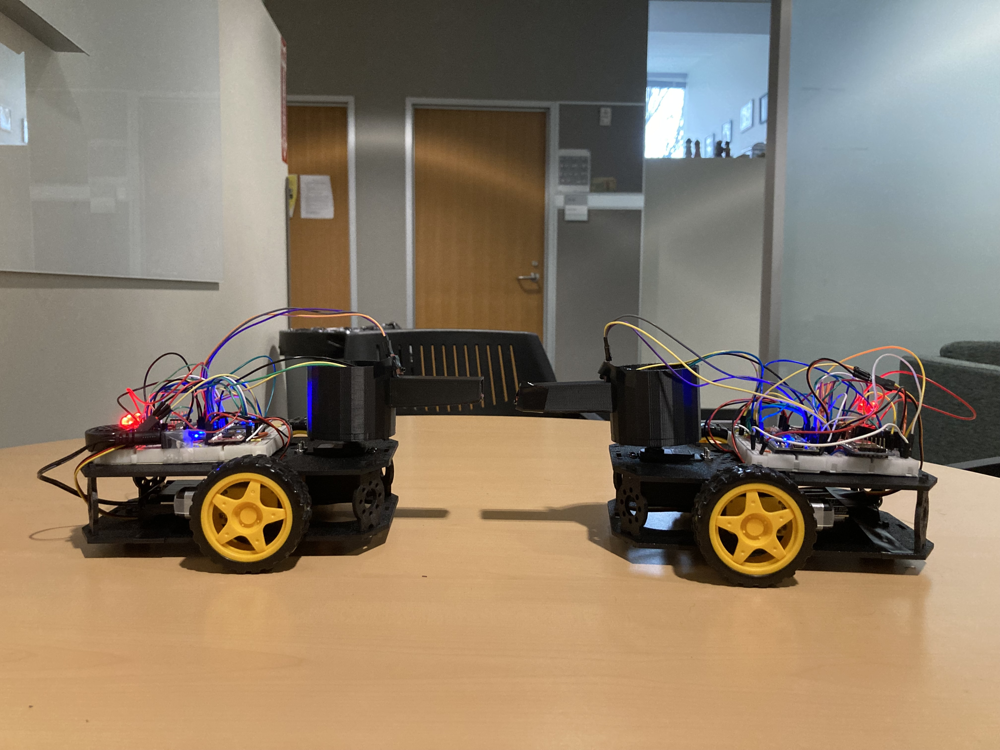
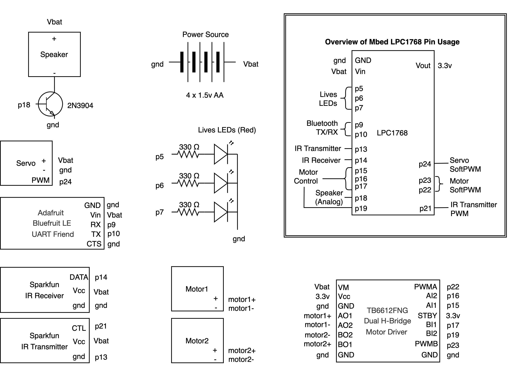
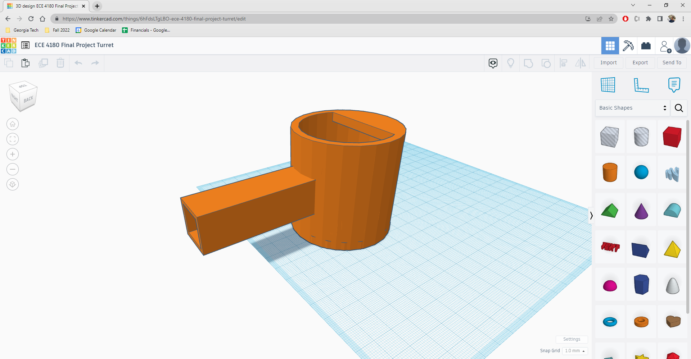
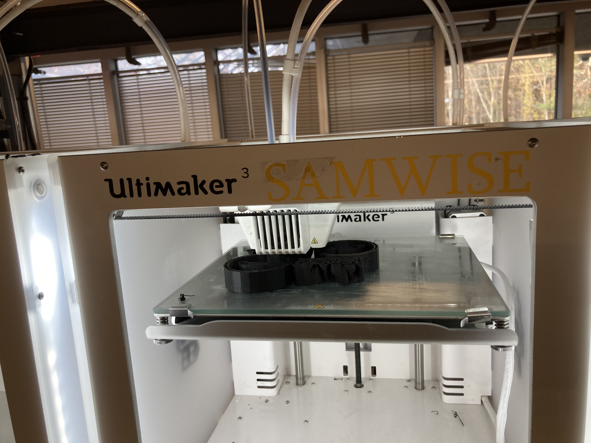

# Duelling Ducks

### ECE 4180 Section B Final Project
Youssef Jaafar  
Cynthia Wang  
Bo Han Zhu  
_Georgia Institute of Technology_

Link to project on Arm Mbed website: https://os.mbed.com/users/cwang776/code/ECE4180-FinalProject/

## Overview
We tried to recreate the classic Tank arcade game in real-life. There are two tanks, more affectionately known as ducks due to their form factor, that can be controlled via Bluetooth using the Adafruit Bluefruit Connect App's Controller Pad. Each tank begins with three lives as indicated by three red LEDs near the back. A player can make seven moves: go forward, go back, turn the tank left, turn the tank right, turn the turret left, turn the turret right, and fire. However, a player has a one-second "cooldown" after firing each time, which is a period of time that ignores any Bluetooth command. The game ends when one player reaches zero lives.  

Sounds accompanies various game scenarios. There is a sound effect for firing, a ricochet sound effect for when a player gets hit, and an explosion sound effect when a player loses all three lives. The shooting is done using an IR transmitter inside each tank's barrel with an IR receiver mounted to the front of each tank's turret. 

Here are some photos of our finished product:  

## Components
The following components were used for each tank:

- 1 [Mbed LPC1768](https://os.mbed.com/platforms/mbed-LPC1768/)
- 1 [Adafruit Bluefruit LE UART Friend](https://www.adafruit.com/product/2479?gclid=Cj0KCQiA7bucBhCeARIsAIOwr--sDuDQVRnRd3sgezZCvbNOrAnr7G2PPKtOtwX-HREZRmz5-t_w148aAn5yEALw_wcB)
- 1 mobile device with Bluefruit Connect app

IR shoot/hit functionality:
- 1 [Sparkfun IR receiver module](https://www.sparkfun.com/products/retired/8554)
- 1 [Sparkfun IR LED transmitter module](https://www.sparkfun.com/products/retired/10732)

Sound effects:
- 1 [Sparkfun PCB or breadboard mount speaker 8ohm .1W](https://www.sparkfun.com/products/11089)
- 1 2N3904 transistor

Lives indicators:
- 3 Red LEDs
- 3 330-ohm resistors

Tank body and movement:
- 2 [Hobby gearmotors](https://www.sparkfun.com/products/13302)
- 1 [Dual H-Bridge Motor Driver](https://www.sparkfun.com/products/14451)
- 2 [Wheels](https://www.sparkfun.com/products/13259)
- 1 [Sparkfun robot chassis](https://www.sparkfun.com/products/13301)
- 1 [Hitec HS-422 RC Servo Motor](https://hitecrcd.com/products/servos/analog/sport-2/hs-422/product)
- 1 Turret (3D-printed)

Power:
- 4 AA batteries and battery holder with power jack (or 1 5V 2A wall adapter)
- 1 power barrel connector jack

### Electrical
Some text here

Wiring Diagram:

### Firmware
Some text here

### Mechanical
Most of the robot is assembled using parts following the instructions from the ECE 4180 robot kit. We were able to attach the breadboards to the chassis and the servo mount to the turret base using 3M heavy duty double-sided tape. One part that was unique to our design was the turret, which was CADed by our team in TinkerCad and 3D-printed at the Invention Studio. The requirements was that it had an opening on the top for electronics and wires to go through, have the barrel width/height just wide enough to support the width/height of the IR transmitter (approx. 1.2cm width by 1.8cm height), and be in the general shape of a tank turret. Our limit was the 3D-printing time, and thus we had to restrict the overall turret's radius and height. The link the TinkerCad file is https://www.tinkercad.com/things/6hFdsLTgLBO and here is a screenshot of the workspace:  

  
Here is a photo of 3D-printing:  

## Demo

https://user-images.githubusercontent.com/35314533/206045320-a0a3c782-69f8-4f3c-88fc-55b81a513b6c.mp4
